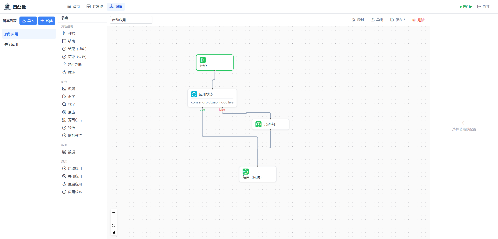
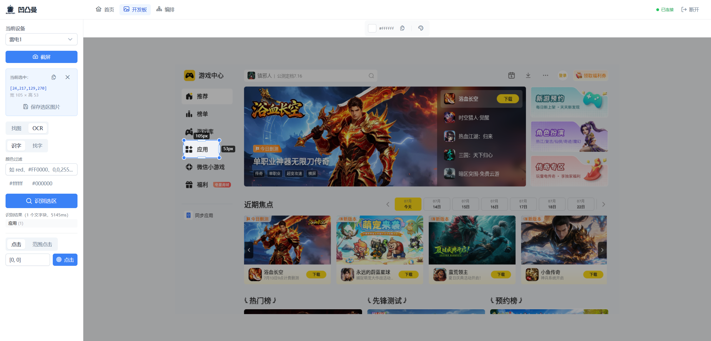
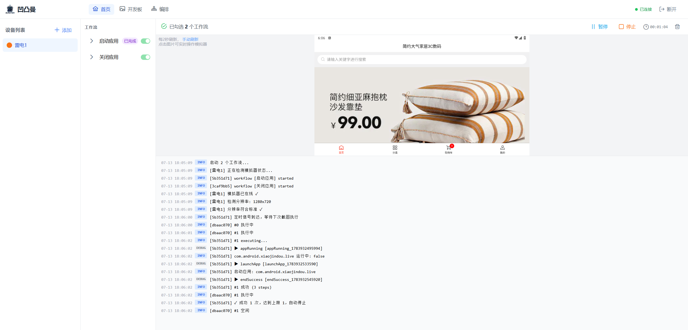

<div align="center">


# 凹凸曼 Automan

**低代码自动化脚本编排引擎**

可视化工作流编辑 · 截图驱动执行 · 多设备并发 · 实时监控

> ⚠️ **技术栈说明**：本项目主体基于 Node.js 运行，Node.js 并非高性能方案，如需极致性能请考虑其他技术选型。

[GitHub](https://github.com/chinjiaqing/automan)

</div>

---

## 产品介绍

凹凸曼是一款面向模拟器自动化任务的可视化工具。

通过 Web 页面管理多台模拟器设备，使用拖拽式节点编辑器构建工作流——识图、OCR、点击、条件判断、循环、随机等待等，系统以截图为输入自动驱动工作流执行。

**适用场景**：游戏养号、UI 自动化、RPA 流程、定时重复任务。

---

## 演示视频

<div align="center">

<video src="https://github.com/user-attachments/assets/012dc44c-ed7a-4533-ae7a-9ef823f910d4" width="600" controls></video>

</div>

---

## 应用截图

<div align="center">







</div>

---

## 模拟器支持

当前版本支持 **雷电模拟器（LDPlayer）**。

| 项目 | 要求 |
|------|------|
| 模拟器 | 雷电模拟器（LDPlayer 9.x） |
| 分辨率 | **1280 × 720**（横屏模式） |
| 连接方式 | ADB（自动连接，无需手动配置） |

> **重要**：模拟器需设置为 **1280×720 横屏模式**。所有工作流中的坐标（点击位置、找图区域等）均基于此分辨率。
>
> 后续计划拓展支持更多模拟器引擎。

---

## 功能一览

### 多设备管理

添加、编辑、删除设备，绑定雷电模拟器实例。每台设备可独立运行多个工作流，互不干扰。设备运行状态实时监控。

### 可视化工作流编辑

拖拽节点构建自动化流程，无需编写代码。

支持的节点类型：

| 类别 | 节点 | 说明 |
|------|------|------|
| 流程 | 开始 / 结束 | 流程起止 |
| 流程 | 结束（成功）/ 结束（失败） | 带计数的结束节点 |
| 流程 | 条件判断 | 根据条件走不同分支 |
| 流程 | 循环 | 重复执行一段流程 |
| 动作 | 找图 | 在截图中搜索目标图片 |
| 动作 | 识字 / 找字 | OCR 文字识别与定位 |
| 动作 | 点击 / 区域点击 | 精确点击或区域内随机点击 |
| 动作 | 延时 / 随机等待 | 固定或随机延时 |
| 应用 | 启动 / 关闭 / 重启应用 | 控制模拟器中的应用 |
| 应用 | 检测应用状态 | 判断应用是否在运行 |
| 数据 | 变量 | 存储和使用数据 |

脚本支持导入、导出、一键复制。

### 双触发模式

- **立即模式**：每次截图自动执行工作流，实时响应
- **定时模式**：设置定时触发时间，支持多个时间点，达标后次日自动重新触发

### 停止条件

可设置成功 N 次或失败 N 次后自动停止，0 表示不限制。

### 实时看板

每 2 秒自动截屏，截图上实时叠加执行注解（识别框、点击波纹、文字区域）。点击看板图片可直接操控模拟器，支持手动刷新截图。执行日志实时滚动显示。

### 设备控制

- 一键开始 / 停止所有工作流
- 设备级暂停 / 恢复
- 运行中设备自动隐藏编辑和删除按钮，防止误操作

### 开发板

截图框选获取坐标、取色工具、找图和 OCR 在线调试、ADB 点击测试——编辑工作流前的调试利器。

---

## 使用流程

### 第一步：启动

运行 `start.bat`，自动完成环境准备、项目构建和服务启动。首次运行需下载 Node.js 和 Python，请耐心等待。

### 第二步：访问

浏览器打开 `http://localhost:3000`，即可进入系统。

### 第三步：添加设备

首页左侧点击「添加设备」→ 输入别名 → 选择 `ldconsole.exe` 路径 → 选择模拟器实例 → 确认创建。

### 第四步：编辑工作流

进入「开发板」截图框选、调试找图和 OCR 效果。  
进入工作流编辑器，拖拽节点搭建自动化流程，保存脚本。

### 第五步：运行

回到首页 → 选中设备 → 勾选工作流 → 配置触发方式和停止条件 → 点击「开始」。

### 第六步：监控

右侧实时看板查看截图和执行注解，日志区查看执行详情。可随时暂停、恢复或停止。

---

## 快速开始

```
git clone https://github.com/chinjiaqing/automan.git
cd automan
start.bat
```

无需预装 Node.js 和 Python，`start.bat` 会自动处理。

启动后访问 `http://localhost:3000` 即可使用。

### 开发者模式

开发者可使用 `start-dev.bat` 启动开发环境（热重载 + 独立前端服务）：

```
start-dev.bat
```

开发模式下前端地址为 `http://localhost:5173`。

---

## 文档

- [产品核心架构](docs/产品核心.md) — 技术架构与 API
- [开发前必读](docs/开发前必读.md) — 开发约束与编码规范

---

## 友好交流

欢迎加入 QQ 群交流讨论，扫码或搜索群号（1014163633）即可加入：

<div align="center">


</div>

---

## 声明

**此项目仅作学习交流使用，请勿用作非法用途。**

---

## 许可证

[MIT](LICENSE) © [chinjiaqing](https://github.com/chinjiaqing)
